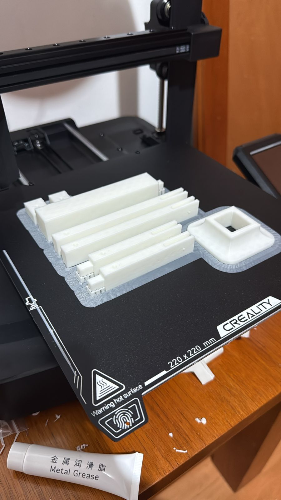
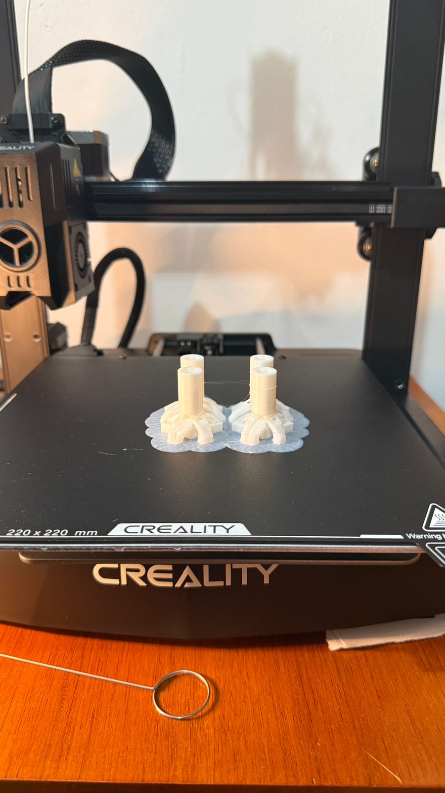
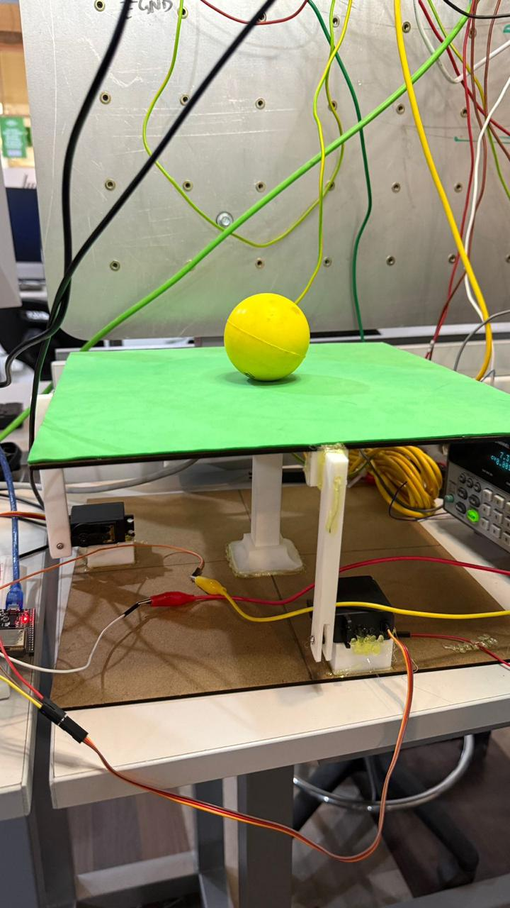
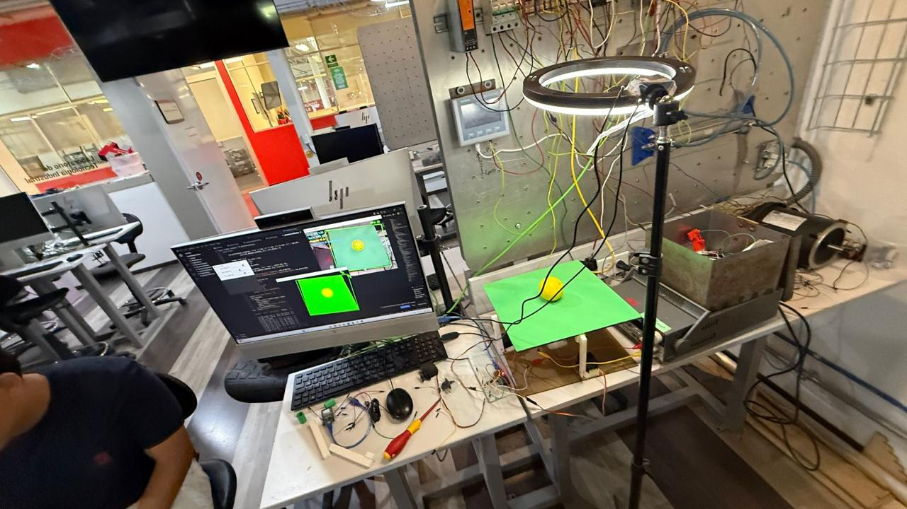

# Proyecto Final: Plataforma - Balance de Pelota.


Este proyecto se centró en el diseño e implementación de un sistema de control de posición en tiempo real. El objetivo fue construir una plataforma dinámica capaz de mantener una pelota centrada sobre su superficie, contrarrestando activamente la fuerza de gravedad mediante la inclinación de la base. El sistema emplea una arquitectura avanzada que combina visión por computadora (Python) para la detección de errores y el microcontrolador ESP32 para la ejecución precisa del movimiento a través de servomotores.


## Marco Teórico.


El proyecto se sustenta en tres pilares tecnológicos: la visión por computadora para la detección de errores, el protocolo de comunicación inalámbrica y la teoría de control.


## 1. Visión por Computadora y Detección de Posición:


Se utilizó Python junto con bibliotecas especializadas (como OpenCV) para capturar el stream de video de la cámara
- Procesamiento: El código identifica el color o las características de la pelota, calcula sus coordenadas (x, y) en la imagen y determina la posición central de la plataforma.
- Error: El error de posición se calcula como la diferencia entre la posición actual de la pelota y el punto central deseado, siendo la entrada principal para el algoritmo de control.


## 2. Protocolo de Comunicación Bluetooth:


Para transmitir los datos del error calculados por la PC (Python) al hardware (ESP32), se empleó la comunicación Bluetooth. Esta elección garantizó una conexión inalámbrica de baja latencia necesaria para las tareas de control en tiempo real, enviando los valores del error "x" y "y" de manera continua.


## 3. Control de Inclinación (Servomotores):


Los servomotores fueron elegidos como actuadores por su capacidad de posicionamiento angular preciso.
- Función: La ESP32 recibe el error y lo traduce en ángulos de inclinación , para los dos servomotores, que controlan los ejes X y Y de la plataforma.
- Control (PID): La relación entre el error de posición y los ángulos de los servomotores generalmente se maneja mediante un algoritmo de control Proporcional-Integral-Derivativo (PID), aunque la implementación básica puede usar solo control Proporcional. El objetivo es que, si la pelota se mueve en la dirección X positiva, la plataforma se incline en la dirección X negativa para corregir el movimiento.


## Materiales.


- Microcontrolador ESP32 DevKit V
- Computadora Host
- Cámara Webcam USB
- 2 Servomotores
- Base de equilibrio (acrílico, madera) y mecanismos de acoplamiento para los servos.
- Módulo de Bluetooth Integrado (en ESP32)
- Software Python y Arduino IDE (para el código del ESP32).


  ## Procedimiento - Elaboracion.


  ## Conexión y montaje.


La plataforma mecánica se construyó sobre dos servomotores, permitiendo el movimiento independiente en dos ejes de inclinación, y su cableado se realizó directamente a pines PWM digitales específicos del ESP32 para el control de ángulo. El flujo de datos inicia con la cámara capturando la imagen, la cual es procesada por Python para calcular el error de posición; Python luego transmite los valores $x, y$ vía Bluetooth a la ESP32, donde el código de Arduino los recibe e inmediatamente los utiliza para calcular y establecer el ángulo de corrección de los servomotores.






## Códigos:


## Código Python:


```cpp
#PruebaBUENA - Modificado: Pelota AMARILLA y Plataforma VERDE

import cv2
import time
import numpy as np
import serial
import serial.tools.list_ports

# ------------------- Configuración Serial Bluetooth -------------------
esp32_port = 'COM14'
baud_rate = 115200

print("=" * 50)
print("Intentando conectar con ESP32...")
print(f"Puerto: {esp32_port} | Baudios: {baud_rate}")

def listar_puertos():
    puertos = serial.tools.list_ports.comports()
    print("\n Puertos COM disponibles:")
    if len(puertos) == 0:
        print("  No se encontraron puertos COM")
    for puerto in puertos:
        print(f"   • {puerto.device}: {puerto.description}")
    print()

listar_puertos()

try:
    esp32 = serial.Serial(esp32_port, baud_rate, timeout=1)
    time.sleep(2)
    print(f" ¡Conectado al ESP32 en {esp32_port}!")
except serial.SerialException as e:
    print(f" Error de conexión serial: {e}")
    esp32 = None
except Exception as e:
    print(f" Error inesperado: {e}")
    esp32 = None

print("=" * 50)

# ------------------- Configuración cámara -------------------
cap = cv2.VideoCapture(1)
cap.set(cv2.CAP_PROP_FRAME_WIDTH, 640)
cap.set(cv2.CAP_PROP_FRAME_HEIGHT, 480)

if not cap.isOpened():
    print("Error: No se pudo abrir la cámara")
    exit()

# ------------------- Posición inicial servos -------------------
center_angle = 90
current_x = center_angle
current_y = center_angle
DEAD_ZONE = 15  # Zona muerta reducida
smoothing = 0.3  # Suavizado reducido para respuesta más rápida

# ------------------- Parámetros PID ajustables -------------------
Kp = 0.15
Ki = 0.001
Kd = 0.20

prev_error_x = 0
prev_error_y = 0
integral_x = 0
integral_y = 0

MAX_INTEGRAL = 50

# ------------------- Parámetros de detección -------------------
# Rango HSV para plataforma VERDE (modificado)
LOW_GREEN = np.array([35, 40, 40])      # H: 35-85 (verde), S: mínimo 40, V: mínimo 40
HIGH_GREEN = np.array([85, 255, 255])   # Rango amplio para captar diferentes tonos de verde
AREA_MIN_PLATAFORMA = 1000  # Área mínima del cuadrado

# Rango HSV para pelota AMARILLA (modificado)
LOW_YELLOW = np.array([20, 100, 100])    # H: 20-35 (amarillo), S: mínimo 100, V: mínimo 100
HIGH_YELLOW = np.array([35, 255, 255])   # Cubre tonos amarillos brillantes
AREA_MIN_PELOTA = 200
RADIO_MIN_PELOTA = 8

# ------------------- Función para limitar valores -------------------
def constrain(value, min_val, max_val):
    return max(min_val, min(max_val, value))

# ------------------- Callbacks para sliders -------------------
def update_kp(val):
    global Kp
    Kp = val / 100.0  # Slider 0-100, valor real 0.00-1.00
    print(f"Kp = {Kp:.3f}")

def update_ki(val):
    global Ki
    Ki = val / 1000.0  # Slider 0-100, valor real 0.000-0.100
    print(f"Ki = {Ki:.4f}")

def update_kd(val):
    global Kd
    Kd = val / 100.0  # Slider 0-100, valor real 0.00-1.00
    print(f"Kd = {Kd:.3f}")

# ------------------- Crear ventana de control -------------------
cv2.namedWindow('Control PID')
cv2.createTrackbar('Kp x100', 'Control PID', int(Kp * 100), 100, update_kp)
cv2.createTrackbar('Ki x1000', 'Control PID', int(Ki * 1000), 100, update_ki)
cv2.createTrackbar('Kd x100', 'Control PID', int(Kd * 100), 100, update_kd)

prev_time = time.time()
print("=" * 50)
print("Sistema de Balance: Plataforma VERDE + Pelota AMARILLA")
print("=" * 50)
print("CONFIGURACIÓN:")
print(f"  • Centro servos: {center_angle}° (Rango: 0-180°)")
print(f"  • Zona muerta: ±{DEAD_ZONE} píxeles")
print(f"  • Suavizado: {smoothing}")
print(f"  • PID: Kp={Kp} Ki={Ki} Kd={Kd}")
print("\nDETECCIÓN:")
print("  • PLATAFORMA VERDE (HSV): Detecta área más grande de tonos verdes")
print(f"    Rango H: {LOW_GREEN[0]}-{HIGH_GREEN[0]} | S: {LOW_GREEN[1]}-{HIGH_GREEN[1]} | V: {LOW_GREEN[2]}-{HIGH_GREEN[2]}")
print("  • PELOTA AMARILLA: Posición para calcular error")
print(f"    Rango H: {LOW_YELLOW[0]}-{HIGH_YELLOW[0]} | S: {LOW_YELLOW[1]}-{HIGH_YELLOW[1]} | V: {LOW_YELLOW[2]}-{HIGH_YELLOW[2]}")
print("\nCONTROLES:")
print("  • 'q' → Salir")
print("  • 'c' → Resetear integrales")
print("  • Sliders → Ajustar PID en tiempo real")
print("=" * 50)

frame_count = 0
fps_time = time.time()
fps = 0

while True:
    ret, frame = cap.read()
    if not ret:
        print("Error: No se pudo leer frame de la cámara")
        break

    frame = cv2.flip(frame, 1)
    height, width = frame.shape[:2]
    centrox, centroy = width//2, height//2

    # ===============================================================
    # DETECCIÓN 1: PLATAFORMA VERDE (HSV) - ÁREA MÁS GRANDE
    # ===============================================================
    hsv_plat = cv2.cvtColor(frame, cv2.COLOR_BGR2HSV)

    # Máscara para detectar verde
    mask_plataforma = cv2.inRange(hsv_plat, LOW_GREEN, HIGH_GREEN)

    kernel_plat = np.ones((7,7), np.uint8)
    mask_plataforma = cv2.morphologyEx(mask_plataforma, cv2.MORPH_CLOSE, kernel_plat)
    mask_plataforma = cv2.morphologyEx(mask_plataforma, cv2.MORPH_OPEN, kernel_plat)
    mask_plataforma = cv2.dilate(mask_plataforma, kernel_plat, iterations=1)

    contours_plat, _ = cv2.findContours(mask_plataforma, cv2.RETR_EXTERNAL, cv2.CHAIN_APPROX_SIMPLE)
    area_max_plat = 0
    contorno_plat = None
    centro_plataforma = None
    rectangulo_info = None

    for c in contours_plat:
        area = cv2.contourArea(c)
        if area > area_max_plat and area > AREA_MIN_PLATAFORMA:
            area_max_plat = area
            contorno_plat = c
            rectangulo_info = cv2.minAreaRect(c)

            M = cv2.moments(c)
            if M["m00"] != 0:
                cx_plat = int(M["m10"] / M["m00"])
                cy_plat = int(M["m01"] / M["m00"])
                centro_plataforma = (cx_plat, cy_plat)

    # ===============================================================
    # DETECCIÓN 2: PELOTA AMARILLA
    # ===============================================================
    hsv = cv2.cvtColor(frame, cv2.COLOR_BGR2HSV)
    mask_pelota = cv2.inRange(hsv, LOW_YELLOW, HIGH_YELLOW)

    kernel_pelota = np.ones((5,5), np.uint8)
    mask_pelota = cv2.morphologyEx(mask_pelota, cv2.MORPH_OPEN, kernel_pelota)
    mask_pelota = cv2.morphologyEx(mask_pelota, cv2.MORPH_CLOSE, kernel_pelota)
    mask_pelota = cv2.dilate(mask_pelota, kernel_pelota, iterations=1)

    contours_pelota, _ = cv2.findContours(mask_pelota, cv2.RETR_EXTERNAL, cv2.CHAIN_APPROX_SIMPLE)
    area_max_pelota = 0
    contorno_pelota = None
    centro_pelota = None
    radio_pelota = 0

    for c in contours_pelota:
        area = cv2.contourArea(c)
        if area > area_max_pelota:
            area_max_pelota = area
            contorno_pelota = c
            (x_pel, y_pel), radio_pelota = cv2.minEnclosingCircle(c)
            if radio_pelota > RADIO_MIN_PELOTA and area > AREA_MIN_PELOTA:
                centro_pelota = (int(x_pel), int(y_pel))

    # ===============================================================
    # VISUALIZACIÓN
    # ===============================================================
    out_original = frame.copy()

    mask_combinada = cv2.bitwise_or(mask_plataforma, mask_pelota)
    out_deteccion = cv2.cvtColor(mask_combinada, cv2.COLOR_GRAY2BGR)

    # Verde para plataforma, Amarillo para pelota
    out_deteccion[mask_plataforma > 0] = [0, 255, 0]      # Verde
    out_deteccion[mask_pelota > 0] = [0, 255, 255]        # Amarillo (BGR: cyan visualmente amarillo en HSV)

    # ===============================================================
    # CALCULAR TIEMPO
    # ===============================================================
    current_time = time.time()
    dt = current_time - prev_time
    prev_time = current_time
    if dt < 0.001:
        dt = 0.001

    # ===============================================================
    # CONTROL PID
    # ===============================================================
    plataforma_detectada = (contorno_plat is not None and area_max_plat > AREA_MIN_PLATAFORMA and centro_plataforma is not None)
    pelota_detectada = (contorno_pelota is not None and centro_pelota is not None)

    if plataforma_detectada:
        if rectangulo_info:
            box = cv2.boxPoints(rectangulo_info)
            box = np.intp(box)
            cv2.drawContours(out_original, [box], 0, (0, 255, 0), 3)
            cv2.drawContours(out_deteccion, [box], 0, (0, 255, 0), 2)

        cv2.circle(out_original, centro_plataforma, 12, (0, 255, 0), 3)
        cv2.circle(out_original, centro_plataforma, 5, (0, 255, 0), -1)
        cv2.putText(out_original, "PLATAFORMA", (centro_plataforma[0]-40, centro_plataforma[1]-20),
                   cv2.FONT_HERSHEY_SIMPLEX, 0.5, (0, 255, 0), 2)

        if pelota_detectada:
            cv2.circle(out_original, centro_pelota, int(radio_pelota), (0, 255, 255), 2)
            cv2.circle(out_original, centro_pelota, 5, (0, 255, 255), -1)
            cv2.putText(out_original, "PELOTA", (centro_pelota[0]-30, centro_pelota[1]+25),
                       cv2.FONT_HERSHEY_SIMPLEX, 0.5, (0, 255, 255), 2)
            cv2.line(out_original, centro_plataforma, centro_pelota, (0, 255, 255), 2)
            cv2.line(out_deteccion, centro_plataforma, centro_pelota, (255, 255, 255), 2)

            # ===============================================================
            # CALCULAR ERROR: Pelota respecto al centro de la plataforma
            # ===============================================================
            error_x = -(centro_pelota[0] - centro_plataforma[0])
            error_y = (centro_pelota[1] - centro_plataforma[1])

            if abs(error_x) < DEAD_ZONE:
                error_x = 0
            if abs(error_y) < DEAD_ZONE:
                error_y = 0

            integral_x += error_x * dt
            integral_y += error_y * dt
            integral_x = constrain(integral_x, -MAX_INTEGRAL, MAX_INTEGRAL)
            integral_y = constrain(integral_y, -MAX_INTEGRAL, MAX_INTEGRAL)

            derivative_x = (error_x - prev_error_x) / dt
            derivative_y = (error_y - prev_error_y) / dt

            output_x = Kp*error_x + Ki*integral_x + Kd*derivative_x
            output_y = Kp*error_y + Ki*integral_y + Kd*derivative_y

            prev_error_x = error_x
            prev_error_y = error_y

            delta_x = output_x * 0.15
            delta_y = output_y * 0.15

            target_x = center_angle + delta_x
            target_y = center_angle + delta_y

            current_x = current_x * (1 - smoothing) + target_x * smoothing
            current_y = current_y * (1 - smoothing) + target_y * smoothing

            current_x = constrain(current_x, 0, 110)
            current_y = constrain(current_y, 0, 110)

            if esp32:
                mensaje = f"{int(current_x)},{int(current_y)}\n"
                try:
                    esp32.write(mensaje.encode())
                    if esp32.in_waiting > 0:
                        respuesta = esp32.readline().decode('utf-8', errors='ignore').strip()
                        if respuesta and frame_count % 30 == 0:
                            print(f"📡 ESP32: {respuesta}")
                except Exception as e:
                    if frame_count % 30 == 0:
                        print(f"✗ Error: {e}")

            if frame_count % 5 == 0:
                print(f"✓ X={int(current_x):3d}° Y={int(current_y):3d}° | Err X={-error_x:4d} Y={-error_y:4d} | Out X={output_x:6.1f} Y={output_y:6.1f}")

            cv2.putText(out_original, f"Error X:{-error_x} Y:{-error_y}", (10,30),
                        cv2.FONT_HERSHEY_SIMPLEX, 0.6, (255,255,0), 2)
            cv2.putText(out_original, f"Servo X:{int(current_x)} Y:{int(current_y)}", (10,60),
                        cv2.FONT_HERSHEY_SIMPLEX, 0.6, (255,255,0), 2)
            cv2.putText(out_original, f"Distancia: {int(np.sqrt(error_x**2 + error_y**2))} px", (10,90),
                        cv2.FONT_HERSHEY_SIMPLEX, 0.5, (0,255,255), 2)
        else:
            cv2.putText(out_original, "PELOTA NO DETECTADA", (10,30),
                        cv2.FONT_HERSHEY_SIMPLEX, 0.7, (0,165,255), 2)

            integral_x = 0
            integral_y = 0
            prev_error_x = 0
            prev_error_y = 0

            current_x = current_x * (1 - smoothing*0.5) + center_angle * smoothing * 0.5
            current_y = current_y * (1 - smoothing*0.5) + center_angle * smoothing * 0.5

            if esp32 and frame_count % 10 == 0:
                try:
                    esp32.write(f"{int(current_x)},{int(current_y)}\n".encode())
                except:
                    pass

            if frame_count % 30 == 0:
                print(f"⚠ Solo plataforma. Centrando: X={int(current_x)}° Y={int(current_y)}°")
    else:
        cv2.putText(out_original, "PLATAFORMA NO DETECTADA", (10,30),
                    cv2.FONT_HERSHEY_SIMPLEX, 0.7, (0,0,255), 2)

        integral_x = 0
        integral_y = 0
        prev_error_x = 0
        prev_error_y = 0

        current_x = current_x * (1 - smoothing*0.5) + center_angle * smoothing * 0.5
        current_y = current_y * (1 - smoothing*0.5) + center_angle * smoothing * 0.5

        if esp32 and frame_count % 10 == 0:
            try:
                esp32.write(f"{int(current_x)},{int(current_y)}\n".encode())
            except:
                pass

        if frame_count % 30 == 0:
            print(f"⚠ Sin detección. Centrando: X={int(current_x)}° Y={int(current_y)}°")

    cv2.circle(out_original, (centrox, centroy), DEAD_ZONE, (128,128,128), 1)
    cv2.line(out_original, (centrox-15, centroy), (centrox+15, centroy), (128,128,128), 1)
    cv2.line(out_original, (centrox, centroy-15), (centrox, centroy+15), (128,128,128), 1)

    cv2.putText(out_original, f"Plat:{int(area_max_plat)} Pel:{int(area_max_pelota)}", (10,height-40),
                cv2.FONT_HERSHEY_SIMPLEX, 0.5, (200,200,200), 1)

    cv2.putText(out_original, f"PID: Kp={Kp:.2f} Ki={Ki:.3f} Kd={Kd:.2f}", (10,120),
                cv2.FONT_HERSHEY_SIMPLEX, 0.5, (255,200,0), 2)

    frame_count += 1
    if time.time() - fps_time > 1.0:
        fps = frame_count
        frame_count = 0
        fps_time = time.time()

    cv2.putText(out_original, f"FPS: {fps}", (width-100, 30),
                cv2.FONT_HERSHEY_SIMPLEX, 0.6, (0,255,0), 2)

    cv2.imshow("Sistema de Balance - Original", out_original)
    cv2.imshow("Deteccion: Plataforma(Verde) + Pelota(Amarillo)", out_deteccion)

    key = cv2.waitKey(1) & 0xFF
    if key == ord('q'):
        break
    elif key == ord('c'):
        integral_x = 0
        integral_y = 0
        print("Integrales reseteadas")

print("\nCerrando sistema...")
cap.release()
if esp32:
    esp32.write(f"{center_angle},{center_angle}\n".encode())
    time.sleep(0.1)
    esp32.close()
    print("Conexión serial cerrada")
cv2.destroyAllWindows()
print("Sistema finalizado")
```


## Código Arduino:


```cpp
#include <ESP32Servo.h>
#include <BluetoothSerial.h>

// =============== CONFIGURACIÓN BLUETOOTH ===============
String device_name = "ESP32-BT-Slave";
BluetoothSerial SerialBT;

// =============== CONFIGURACIÓN DE PINES ===============
const int PIN_SERVO_X = 18;
const int PIN_SERVO_Y = 19;

// =============== CONFIGURACIÓN DE SERVOS ===============
Servo servoX;
Servo servoY;

const int PWM_MIN = 500;
const int PWM_MAX = 2400;

// =============== POSICIÓN INICIAL (CENTRADA) ===============
const int CENTRO = 90;

// =============== VARIABLES DE COMUNICACIÓN ===============
String inputString = "";
bool stringComplete = false;

// =============== VARIABLES DE CONTROL ===============
int posicionX = CENTRO;
int posicionY = CENTRO;
unsigned long ultimoComando = 0;
const unsigned long TIMEOUT = 2000;

// =============== VARIABLES DE DEBUG ===============
unsigned long contadorComandos = 0;
unsigned long ultimoDebug = 0;
const unsigned long INTERVALO_DEBUG = 1000;

// =============== CONFIGURACIÓN INICIAL ===============
void setup() {
  // Iniciar Serial USB (para debug)
  Serial.begin(115200);
  delay(100);

  // Iniciar Bluetooth Serial
  SerialBT.begin(device_name);
  delay(500);

  inputString.reserve(20);

  // Configurar timers del ESP32
  ESP32PWM::allocateTimer(0);
  ESP32PWM::allocateTimer(1);
  ESP32PWM::allocateTimer(2);
  ESP32PWM::allocateTimer(3);

  // Configurar servos
  servoX.attach(PIN_SERVO_X, PWM_MIN, PWM_MAX);
  servoY.attach(PIN_SERVO_Y, PWM_MIN, PWM_MAX);

  // Mover a posición inicial (CENTRO)
  Serial.println("\n========================================");
  Serial.println("Inicializando servos en posicion central...");
  servoX.write(CENTRO);
  servoY.write(CENTRO);
  delay(1000);
  Serial.println("Servos centrados!");

  // Mensaje de inicio (USB)
  Serial.println("========================================");
  Serial.println("ESP32 - Sistema de Balance BLUETOOTH");
  Serial.println("========================================");
  Serial.print("Nombre Bluetooth: ");
  Serial.println(device_name);
  Serial.print("Servo X en GPIO ");
  Serial.println(PIN_SERVO_X);
  Serial.print("Servo Y en GPIO ");
  Serial.println(PIN_SERVO_Y);
  Serial.print("Posicion inicial: ");
  Serial.print(CENTRO);
  Serial.println(" grados");
  Serial.println("========================================");
  Serial.println("Esperando conexion Bluetooth...");
  Serial.println("========================================\n");

  // Mensaje de inicio (Bluetooth)
  SerialBT.println("ESP32 Balance System Ready");
  SerialBT.println("Servos centrados en 90 grados");
  SerialBT.println("Esperando comandos...");

  ultimoComando = millis();
  ultimoDebug = millis();
}

// =============== BUCLE PRINCIPAL ===============
void loop() {
  // Leer datos desde Bluetooth
  while (SerialBT.available()) {
    char inChar = (char)SerialBT.read();

    if (inChar == '\n' || inChar == '\r') {
      if (inputString.length() > 0) {
        stringComplete = true;
      }
    } else {
      inputString += inChar;
    }
  }

  // Procesar comando si está completo
  if (stringComplete) {
    procesarComando();
    inputString = "";
    stringComplete = false;
    ultimoComando = millis();
  }

  // Debug periódico (solo por USB)
  if (millis() - ultimoDebug > INTERVALO_DEBUG) {
    mostrarEstado();
    ultimoDebug = millis();
  }

  // Timeout - volver al centro si no hay comandos
  if (millis() - ultimoComando > TIMEOUT) {
    volverAlCentro();
  }
}

// =============== FUNCIÓN: PROCESAR COMANDO ===============
void procesarComando() {
  contadorComandos++;

  // Debug por USB
  Serial.print("[BT-CMD #");
  Serial.print(contadorComandos);
  Serial.print("] '");
  Serial.print(inputString);
  Serial.print("' -> ");

  int comaIndex = inputString.indexOf(',');

  if (comaIndex > 0) {
    String valorXStr = inputString.substring(0, comaIndex);
    String valorYStr = inputString.substring(comaIndex + 1);

    int xRecibido = valorXStr.toInt();
    int yRecibido = valorYStr.toInt();

    // Debug
    Serial.print("X=");
    Serial.print(xRecibido);
    Serial.print(" Y=");
    Serial.print(yRecibido);

    // Validar y limitar (0-180 grados)
    xRecibido = constrain(xRecibido, 0, 180);
    yRecibido = constrain(yRecibido, 0, 180);

    // Mostrar cambio
    if (xRecibido != posicionX || yRecibido != posicionY) {
      Serial.print(" | Moviendo: X(");
      Serial.print(posicionX);
      Serial.print("→");
      Serial.print(xRecibido);
      Serial.print("°) Y(");
      Serial.print(posicionY);
      Serial.print("→");
      Serial.print(yRecibido);
      Serial.println("°)");
    } else {
      Serial.println(" | Sin cambio");
    }

    // Actualizar posiciones
    posicionX = xRecibido;
    posicionY = yRecibido;

    // Mover servos a las nuevas posiciones
    servoX.write(posicionX);
    servoY.write(posicionY);

    // Confirmación por Bluetooth a Python
    SerialBT.print("OK: ");
    SerialBT.print(posicionX);
    SerialBT.print(",");
    SerialBT.println(posicionY);

  } else {
    Serial.println("ERROR - Formato invalido");
    SerialBT.println("Error: Formato invalido. Use X,Y");
  }
}

// =============== FUNCIÓN: MOSTRAR ESTADO ===============
void mostrarEstado() {
  if (SerialBT.hasClient()) {
    Serial.print("[ESTADO] BT conectado | X=");
  } else {
    Serial.print("[ESTADO] BT desconectado | X=");
  }
  Serial.print(posicionX);
  Serial.print("° Y=");
  Serial.print(posicionY);
  Serial.print("° | Cmds: ");
  Serial.print(contadorComandos);
  Serial.print(" | Sin datos: ");
  Serial.print((millis() - ultimoComando) / 1000);
  Serial.println("s");
}

// =============== FUNCIÓN: VOLVER AL CENTRO ===============
void volverAlCentro() {
  static bool mensajeMostrado = false;
  static unsigned long ultimoCentrado = 0;

  if (millis() - ultimoCentrado < 500) {
    return;
  }
  ultimoCentrado = millis();

  if (posicionX != CENTRO || posicionY != CENTRO) {
    if (!mensajeMostrado) {
      Serial.println("\n[TIMEOUT] Volviendo al centro...");
      SerialBT.println("Timeout: Centrando servos...");
      mensajeMostrado = true;
    }

    // Movimiento gradual al centro
    if (posicionX < CENTRO) posicionX += 2;
    if (posicionX > CENTRO) posicionX -= 2;
    if (posicionY < CENTRO) posicionY += 2;
    if (posicionY > CENTRO) posicionY -= 2;

    // Ajuste fino
    if (abs(posicionX - CENTRO) == 1) posicionX = CENTRO;
    if (abs(posicionY - CENTRO) == 1) posicionY = CENTRO;

    servoX.write(posicionX);
    servoY.write(posicionY);

    Serial.print("  Centrando: X=");
    Serial.print(posicionX);
    Serial.print("° Y=");
    Serial.print(posicionY);
    Serial.println("°");
  } else {
    if (mensajeMostrado) {
      Serial.println("[CENTRADO] Completo\n");
      mensajeMostrado = false;
      ultimoComando = millis();
    }
  }
```


## Resultados






La validación del sistema se centró en tres subsistemas clave. En cuanto a la Visión, la plataforma demostró ser capaz de calcular el error de posición $(x, y)$ de la pelota con la precisión necesaria para la tarea de equilibrio. La Conectividad se confirmó con el establecimiento y mantenimiento de una conexión Bluetooth estable entre la PC y el ESP32, presentando una latencia lo suficientemente baja para ejecutar las correcciones de la plataforma de manera rápida y efectiva. Finalmente, el Control de Posición fue exitoso, ya que el sistema logró mover la pelota desde cualquier posición inicial descentrada hacia el punto central y, más importante aún, cumplió el objetivo principal: mantener el objeto en equilibrio sobre la plataforma por un tiempo prolongado, contrarrestando eficientemente cualquier perturbación.


<video width="400" controls>
  <source src="../imgs/plataforma/videotabla.mp4" type="video/mp4">
</video>


## Conclusiones


El proyecto de Plataforma de Balanceo de Bola demostró la aplicación efectiva de la ingeniería de control y la visión por computadora. Se logró integrar con éxito tres dominios: el procesamiento de alto nivel (Python/OpenCV), la comunicación inalámbrica (Bluetooth) y el control de actuadores de precisión (Servomotores/ESP32). Este sistema valida la capacidad de la arquitectura PC-Microcontrolador para resolver problemas de control dinámico que requieren un alto poder de cómputo para la detección de errores.

