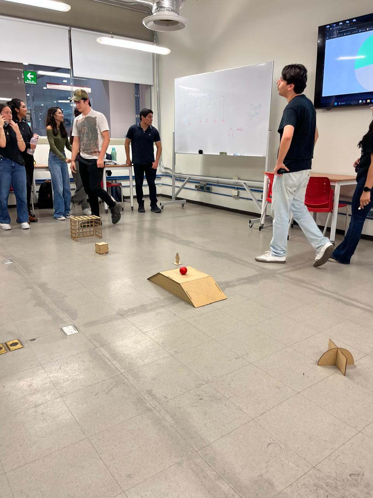

# Proyecto medio semestre: Coches Robots - Partido de fútbol


## Objetivo 


El proyecto consistió en el diseño y construcción de un carro robot teledirigido cuyo principal propósito era competir exitosamente en un torneo de fútbol de robots, enfocándose en la alta maniobrabilidad para manipular la pelota y marcar goles. La arquitectura técnica se basó en el microcontrolador ESP32 para el control, implementando un sistema de dirección inalámbrica que utiliza un mando de PS4 conectado vía Bluetooth.


## Arquitectura - Tecnología: Marco teórico


- Microcontrolador: Se eligió el ESP32 específicamente por su arquitectura de doble núcleo y, lo más importante, su conectividad Bluetooth integrada, crucial para recibir comandos inalámbricos y en tiempo real desde el controlador de PlayStation.
- Driver de Motor: Se empleó un Puente H (como el L298N) para actuar como interfaz de potencia, ya que el ESP32 no tiene la capacidad de suministrar la alta corriente requerida por los motores DC.
- Movimiento: La cinemática implementada fue la de Tracción Diferencial. Esta se logró enviando señales de PWM (Modulación por Ancho de Pulso) a los motores, permitiendo movimientos precisos como el avance, retroceso y giros controlados.





## Materiales


- ESP 32: La unidad central de procesamiento y gestión de la comunicación Bluetooth.
- PUENTE H: Proporcionar la potencia adecuada para la operación de los motores.
- CONTROL PS4: La interfaz de control remoto para emitir comandos de movimiento.
- Pilas 3.7V / 2600 mAh: Suministro de energía al sistema.
- MOTORES DC: Elementos actuadores que proporcionan la tracción.
- MDF / IMPRESION 3D: Materiales utilizados para la estructura (chasis, cubiertas y pala frontal).


  ## Procedimiento - Elaboración


El desarrollo del proyecto se llevó a cabo mediante una aproximación colaborativa, dividida en las siguientes áreas de especialización


- Electronica: Este equipo se encargó de la planificación y montaje del circuito, incluyendo el diseño del diagrama, la conexión segura del driver de motor, la integración de fusibles, el sistema de baterías y el cableado general del robot.
- Programacion: Se centró en el desarrollo del firmware necesario para establecer la conexión Bluetooth con el control y, vitalmente, crear la lógica de control de motores, que traduce las entradas del joystick en las señales de movimiento deseadas.
- Mecanica: Esta área fue responsable del diseño físico (chasis de cuatro ruedas) y el ensamblaje, incluyendo la creación e integración de la pala frontal diseñada para la interacción eficiente con la pelota.


  ## Codigo de programación (Arduino)


Este firmware gestiona la conexión con el control PS4 y utiliza la lógica de tracción diferencial y ajuste de velocidad (con el gatillo R2) para el control del carro.


```cpp
/**
 * @file Robot_Futbol_PS4_ESP32.ino
 * @brief Código para controlar un carro robot de fútbol usando un ESP32 y un control PS4.
 * Incluye funciones para avance, retroceso, giros y tracción diferencial mediante Joysticks.
 */

// Bibliotecas necesarias:
#include <Arduino.h>
#include <PS4Controller.h> 

// --- Configuración de Pines y Variables ---
int enA = 25; int enB = 14; // Pines de Enable (PWM)
int IN1 = 26; int IN2 = 27; int IN3 = 32; int IN4 = 33; // Pines de Dirección
#define R 0 // Canal LEDC para Motor Derecho
#define L 1 // Canal LEDC para Motor Izquierdo
int Speed = 210; // Velocidad base inicial
int threshold = 10; // Umbral de sensibilidad para Joysticks

// --- Declaración de Funciones de Movimiento ---
void forward(); void backward(); void left(); void right(); void stop();
void setMotor(int leftMotor, int rightMotor);

// --- Setup (Configuración Inicial) ---
void setup() {
    Serial.begin(115200);
    // *IMPORTANTE*: Reemplace la MAC Address con la de su control PS4.
    PS4.begin("98:3b:8f:fc:0c:82"); 
    Serial.println("Esperando control PS4...");
    ledcAttachChannel(enA, 5000, 8, R);
    ledcAttachChannel(enB, 5000, 8, L);
    pinMode(IN1, OUTPUT); pinMode(IN2, OUTPUT);
    pinMode(IN3, OUTPUT); pinMode(IN4, OUTPUT);
    stop();
}

// --- Loop Principal (Ejecución Continua) ---
void loop() {
    if (PS4.isConnected()) {
        // 1. Ajuste de Velocidad con R2
        Speed = map(PS4.R2Value(), 0, 255, 210, 255);
```


## Conclusion y Resultados


El proyecto finalizó con éxito, resultando en un vehículo robótico completamente funcional que no solo cumplió con los requisitos de diseño, sino que también demostró un desempeño excepcional en el torneo de "Fútbol de Coches", donde el equipo resultó ganador. La verificación funcional confirmó la estabilidad del movimiento lineal y la alta maniobrabilidad lograda mediante el sistema de tracción diferencial y señales PWM precisas. Además, la conexión Bluetooth entre el control de PlayStation y el ESP32 mantuvo una latencia mínima, permitiendo un control en tiempo real que fue decisivo para el éxito ofensivo (anotando aproximadamente 4 goles). En conclusión, el proyecto fue un éxito técnico que validó la versatilidad del ESP32 como microcontrolador central para aplicaciones de control de alto rendimiento y tiempo real, combinando eficazmente la conectividad inalámbrica con el manejo de potencia.
